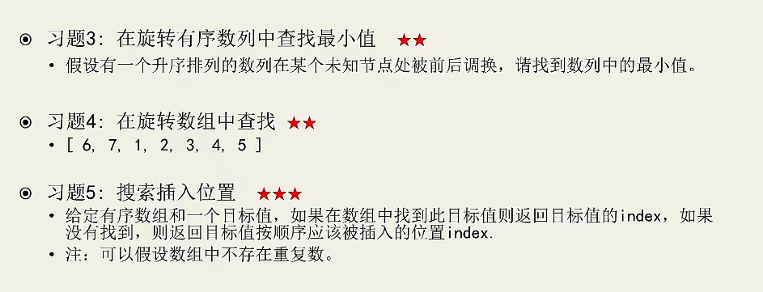
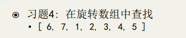
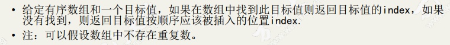
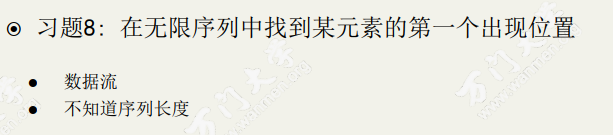
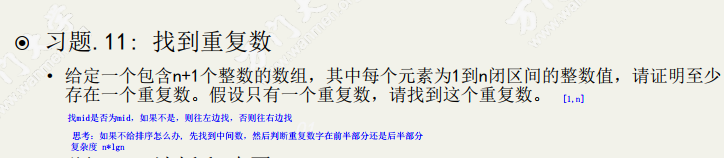

# 二分搜索
- 经典的二分搜索法需要先找到目标值的第一个位置，如果没找到则返回-1

- 最后一个位置以及其他位置怎么处理
  - 排序
  - 判断重复
  - 有无负数

- 递归 迭代

## 习题2
模板

## 习题3，4，5：
- 题目3中如果先调用sort再找最小值，复杂度O(nlgn)
- 如果直接用min函数，复杂度O(n)
- 用二分法搜索，复杂度是O(lgn)的

lgn的复杂度只有二分法可以解

## 习题4：

6 7 1 2 3 4 5 中间查找某一个数

## 习题5：
- 搜索目标插入位置
- 如果找到，返回目标值的index
- 如果找不到，返回插入位置的index

找到第一个大于x的数

## 习题8 未知序列长度，找到特定的值，用倍乘法

## 习题9 设计有固定供暖半径的供暖设备给房屋供暖， 已知房屋和供暖设备在同一水平线上的位置分布，
找到能给所有房屋供暖的供暖设备的最小供暖半径

## 习题12 搜索第k大的数

因为矩阵每行和每列都是有序的，可以使用二分查找来进行；取矩阵中前后两个数值的平均值来做查找，
平均值跟矩阵中的数做对比，从上到下，从右到左，假如平均值大于等于矩阵的某一行的第N个值那么，
那行就有N个数小于平均值，下一行就从第N个数开始比较，因为上一行的第N+1个数值比平均值大，
下一行的肯定比平均值大，所以可以从第N个数开始；然后得到平均值比矩阵中的数大于等于的个数S，
如果S大于等于K，最右边的数值R=平均值，否则，最左边的数值L=平均值+1；按照上述查找S的个数，
然后和K比较，直到R不再大于L，输出L。

## 习题13 找重复数

1-n个数字，首先找到中间数m，统计小于m的数字的数量，判断重复的数字在前边还是在后边[L,R] 时间复杂度nlgn